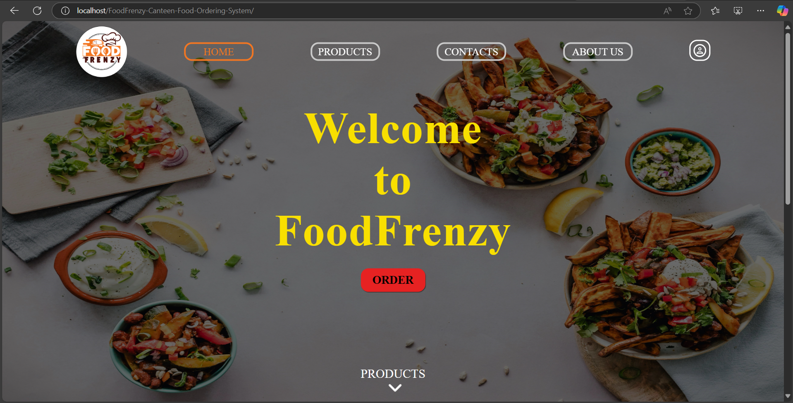

# 🍽️ FoodFrenzy Canteen & Food Ordering System  

A **web-based food ordering system** for a canteen, built using **HTML, CSS, JavaScript, and PHP**. The system allows users to order food online, while the admin manages orders, food items, and customers.  

---

## 🚀 Features  

### ✅ User Features  
- **User Registration & Login**  
- **Order Food Online** (Only registered users can order)  
- **Discounted Prices** for registered users  
- **Wallet System**: Users can deposit money (Admin updates the wallet)
- **Account Deletion Notifications**

### ✅ Admin Features  
- **Admin Panel** to manage:  
  - **Orders** (View, fulfill, and update order statuses)  
  - **Menu** (Add/edit food items, define normal & discount prices)  
  - **Wallet Updates** (Manage user balances)  
  - **Contact Forms** (Reply to user inquiries)

### ✅ Other Features  
- **Email Notifications** via **PHPMailer**  
  - OTP for **Signup & Password Reset**    
- **PDF Invoice Generation** using **TCPDF**  
- **Unified Login Page** for both users and admin (redirects accordingly)  

---

## 📸 Screenshots  

| Unregistered User Dashboard | Sign-in Screen | Admin Panel |
|---------------------------|-------------|-------------|
|  |  |  |  

---

## 📂 Project Structure  
```
📂 FoodFrenzy-Canteen-Food-Ordering-System
│── 📂 application
│── 📂 configuration
│── 📂 storage
│── 📂 vendors
│── index.php
│── README.md
```

---

## 🛠️ Installation Guide  

### 1️⃣ Prerequisites  
- **XAMPP** (or any local server)  
- **MySQL Database**  
- **Composer** (for managing/updating PHPMailer & TCPDF)  
<br/>

### 2️⃣ Setting Up the Database (Using XAMPP)  

1. Open **phpMyAdmin** in your XAMPP control panel.  
2. Select the **SQL** tab in the top navigation.  
3. Create a new database:  

```sql
CREATE DATABASE foodfrenzy;
```

<br/>

### 3️⃣ Import foodfrenzy.sql File

1. Select the foodfrenzy database in the left panel.
   


2. Click the Import tab in the top navigation.
   
3. Choose the file: ```FoodFrenzy-Canteen-Food-Ordering-System/configuration/sql/foodfrenzy.sql```
   
4. Set options:
    - **Character Set: utf-8**
    - **Enable Foreign Key Checks**
    - **Format: SQL**
    - **SQL Compatibility Mode: None**
    - **Do not use AUTO_INCREMENT for zero values**


5. Click Import.


<br/>

### 4️⃣ Configuring the Project

1. Place the project folder inside htdocs (if using XAMPP).
   
2. Update database credentials in: ```FoodFrenzy-Canteen-Food-Ordering-System/configuration/php/connect_to_database/con_server.php```
```
$servername = "localhost";
$username = "root"; // Default XAMPP username
$password = ""; // Default is empty
$database = "foodfrenzy";
```
<br/>


### 5️⃣ Setting Up Admin Account

1. Modify create_admin.php to set a custom username & password: ```http://localhost/FoodFrenzy-Canteen-Food-Ordering-System/application/backend/php/admin/add_admin/create_admin.php```
    - Ensure the user_id is 7 characters long.


      
3. Run the file in the browser.


<br>

### 6️⃣  Email & Third-Party Integrations

1. Enable App Passwords in Google Account Security Settings.
2. Generate a 16-digit App Password for email services.
3. Create a new file: ```D:\my_projects\config\config.php```
(You can change this path, but you must update backend email configurations accordingly.)
4. Add your email and App Password in config.php.
   


<br>

---

### 📝 Technologies Used
- **Frontend: HTML, CSS, JavaScript**<br/>
- **Backend: PHP, MySQL**<br/>
- **Security: Argon2 Password Hashing**<br/>
- **Libraries:** <br/>
    - PHPMailer (for email notifications)<br/>
    - TCPDF (for generating invoices)
<br/>

---

⚠️ Important Notes<br/>
🚨 This project is not yet optimized for mobile devices. Best viewed on larger screens.<br/>
🚨 All users have high-privilege database operations.<br/> 
🚨 The system does not steal credentials or contain malicious code.<br/>
🚨 Ensure third-party libraries are properly configured for compatibility.
